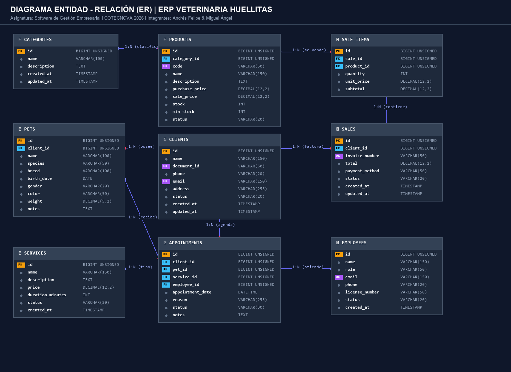
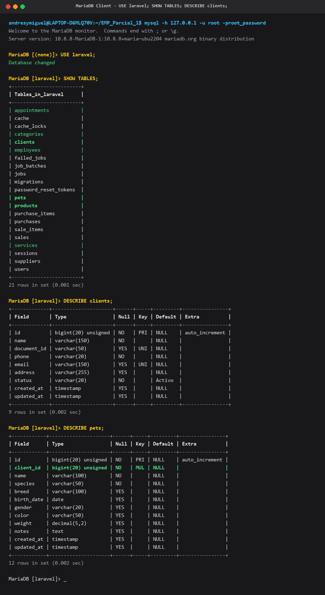
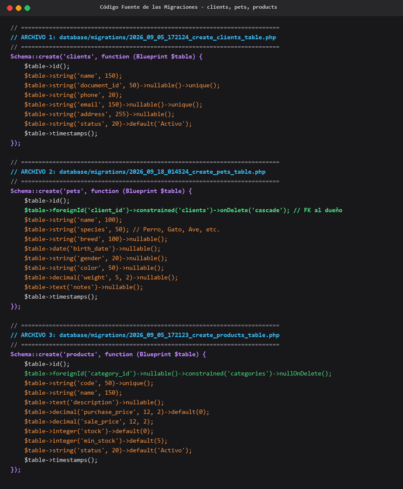
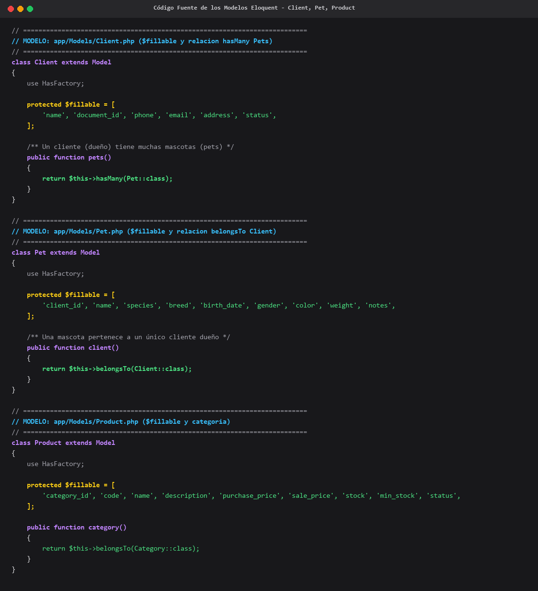
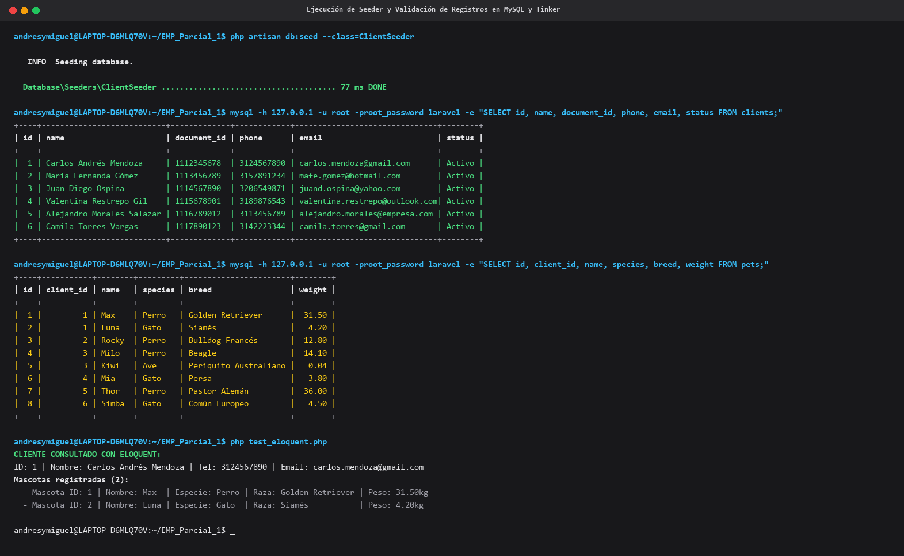

# ERP Veterinaria Huellitas - Primer Parcial
**Institución:** Corporación de Estudios Tecnológicos del Norte del Valle (COTECNOVA) - 2026  
**Asignatura:** Software de Gestión Empresarial  
**Docente:** James Canos  
**Modalidad:** Parejas / Proyecto  
**Integrantes:** Andrés Felipe & Miguel Ángel  
**Repositorio GitHub:** [https://github.com/NiquelAwol/PrimerParcialEMP](https://github.com/NiquelAwol/PrimerParcialEMP)  
**Rama Oficial:** `parcial`  

---

## 📋 Descripción del Proyecto

Este repositorio contiene la solución completa del **Primer Parcial** de la asignatura **Software de Gestión Empresarial**, correspondiente al análisis, diseño e implementación básica de un sistema ERP para la empresa **"Veterinaria Huellitas"**.

La veterinaria requería modernizar sus procesos manuales (previamente llevados en cuadernos y hojas de cálculo) para resolver problemas de pérdida de información en historias clínicas, errores y descuadres de inventario, y falta de métricas para la toma de decisiones gerenciales.

A continuación, se presentan las **evidencias y capturas de pantalla solicitadas en la guía del parcial**, detalladamente explicadas paso a paso con sus fundamentos técnicos y de negocio.

---

## 📊 Diagrama Entidad-Relación (ER) del Sistema ERP



#### 📝 Explicación del Modelo Entidad-Relación:
El diagrama modela la arquitectura de datos completa del ERP para la **Veterinaria Huellitas**, estructurado en torno a 9 entidades que garantizan la integridad referencial y cubren el ciclo operativo clínico y comercial:

1. **`clients` (Dueños de Mascotas):** Representa a las personas naturales responsables de los pacientes y titulares de la facturación. Posee clave primaria `id`, documento único (`document_id`), teléfono, correo único (`email`) y estado.
2. **`pets` (Pacientes / Mascotas):** Registra a los pacientes atendidos en la clínica. Se relaciona de forma jerárquica con `clients` mediante la clave foránea `client_id` (`1:N`, un cliente puede tener múltiples mascotas, pero cada mascota pertenece a un único dueño).
3. **`categories` (Categorías de Productos):** Agrupa los insumos y artículos de la veterinaria (Medicamentos, Alimentos, Accesorios, Juguetes, Higiene). Se relaciona `1:N` con `products`.
4. **`products` (Medicamentos, Alimentos e Insumos):** Catálogo de existencias de farmacia y mostrador con clave foránea `category_id`, código SKU único, precios de compra y venta, existencias actuales y umbral de stock mínimo para alertas.
5. **`services` (Servicios Veterinarios y Estéticos):** Catálogo de procedimientos médicos y de bienestar (consultas, vacunaciones, cirugías, odontología, peluquería) con duración estimada y tarifas fijadas.
6. **`employees` (Personal de la Veterinaria):** Médicos veterinarios, cirujanos, auxiliares clínicos, recepcionistas y estilistas con número de tarjeta profesional y rol.
7. **`appointments` (Citas y Agendamiento Clínico):** Núcleo de la gestión operativa. Interconecta cuatro entidades:
   - `client_id` (FK a `clients`): Cliente que solicita la cita.
   - `pet_id` (FK a `pets`): Mascota que recibirá la atención médica.
   - `service_id` (FK a `services`): Procedimiento clínico o estético a ejecutar.
   - `employee_id` (FK a `employees`): Profesional veterinario asignado.
8. **`sales` (Facturación / Ventas):** Registra el encabezado del comprobante fiscal, vinculando al cliente (`client_id`), total facturado, método de pago y estado de la transacción.
9. **`sale_items` (Detalle de Venta):** Líneas de la factura que relacionan la venta (`sale_id`) con los productos adquiridos (`product_id`), especificando cantidad, precio unitario aplicado y subtotal.

---

## 📸 Entregables Visuales de Implementación y Explicación Técnica

---

### 1. Tablas en MySQL (`SHOW TABLES;` y `DESCRIBE clients;`)



#### 📝 Explicación del Entregable:
- **Motor de Base de Datos:** MariaDB 10.8 / MySQL en entorno Docker bajo WSL2, escuchando en el puerto estándar `3306`.
- **Selección de la Base de Datos:** Se ejecutó el comando `USE laravel;`, seleccionando el esquema principal de la aplicación.
- **Verificación de Tablas Creadas (`SHOW TABLES;`):**  
  La salida confirma que el motor ha generado exitosamente la totalidad de las 21 tablas del sistema ERP. Entre ellas destacan las tablas requeridas por el parcial:
  - `clients`: Dueños de mascotas (personas naturales).
  - `pets`: Pacientes / mascotas asociadas a sus dueños.
  - `products`: Catálogo de medicamentos, alimentos, accesorios y juguetes.
  - `categories`: Categorías de clasificación de productos.
  - `services`: Consultas médicas, vacunación, cirugías, baño y peluquería.
  - `appointments`: Citas médicas y agendamiento clínico.
  - `employees`: Veterinarios, auxiliares, recepcionistas y peluqueros.
  - `sales` y `sale_items`: Facturación y detalle de ventas.
- **Estructura de la Tabla `clients` (`DESCRIBE clients;`):**  
  Se valida que la tabla `clients` cuenta con:
  - `id`: `bigint(20) unsigned`, llave primaria autoincremental (`PRI`).
  - `name`: `varchar(150)`, nombre completo del propietario.
  - `document_id`: `varchar(50)`, cédula o documento único (`UNI`).
  - `phone`: `varchar(20)`, teléfono principal de contacto.
  - `email`: `varchar(150)`, correo electrónico con restricción de unicidad (`UNI`).
  - `address`: `varchar(255)`, dirección domiciliaria.
  - `status`: `varchar(20)`, estado del cliente con valor por defecto `'Activo'`.
  - `created_at` y `updated_at`: marcas de tiempo de auditoría.
- **Estructura de la Tabla `pets` (`DESCRIBE pets;`):**  
  Se verifica la relación con `client_id` como clave foránea (`MUL`), junto con `name`, `species` (perro, gato, ave), `breed`, `birth_date`, `gender`, `color`, `weight` (peso en decimal) y `notes` (observaciones médicas).

---

### 2. Código Fuente de las Migraciones (`clients`, `pets`, `products`)



#### 📝 Explicación del Entregable:
Las migraciones definen la estructura del esquema relacional de manera versionada mediante Laravel Blueprint:

1. **Migración `create_clients_table.php`:**
   - Define los campos para personas naturales propietarias de animales de compañía.
   - Aplica restricciones de unicidad para evitar duplicidad de registros en cédulas (`document_id`) y correos electrónicos (`email`).
   - Asigna valores predeterminados para garantizar la integridad operativa (`status = 'Activo'`).

2. **Migración `create_pets_table.php`:**
   - Implementa la clave foránea `client_id` mediante el método `$table->foreignId('client_id')->constrained('clients')->onDelete('cascade');`.
   - La cláusula `onDelete('cascade')` asegura la integridad referencial: si un cliente es dado de baja, sus expedientes clínicos asociados se gestionan coherentemente sin dejar registros huérfanos.
   - Incluye atributos veterinarios vitales: especie animal, raza, fecha de nacimiento, sexo, pelaje, peso en kilogramos con precisión decimal (`decimal('weight', 5, 2)`) y notas de alergias/antecedentes patológicos (`text('notes')`).

3. **Migración `create_products_table.php`:**
   - Establece la relación opcional con categorías (`category_id`) mediante `nullOnDelete()`.
   - Incorpora el código único institucional (`code`), nombre comercial, posología o descripción, precio de costo de compra (`purchase_price`), precio de venta al público (`sale_price`), existencias físicas (`stock`) y un umbral de seguridad de stock mínimo (`min_stock`) con valor base de 5 unidades para disparar alertas preventivas de desabastecimiento.

---

### 3. Código Fuente de los Modelos Eloquent y Relaciones



#### 📝 Explicación del Entregable:
Se diseñaron los modelos de dominio basados en el patrón Active Record de Laravel Eloquent, protegiendo contra asignación masiva mediante `$fillable` y encapsulando la lógica relacional:

1. **Modelo `Client.php` (`app/Models/Client.php`):**
   - **Atributos Asignables (`$fillable`):** Protege los campos `'name'`, `'document_id'`, `'phone'`, `'email'`, `'address'`, `'status'`.
   - **Relación `hasMany` (1 a Muchos con Mascotas):**
     ```php
     public function pets()
     {
         return $this->hasMany(Pet::class);
     }
     ```
     Un cliente (dueño) puede poseer y registrar múltiples mascotas en la veterinaria.

2. **Modelo `Pet.php` (`app/Models/Pet.php`):**
   - **Atributos Asignables (`$fillable`):** Incluye `'client_id'`, `'name'`, `'species'`, `'breed'`, `'birth_date'`, `'gender'`, `'color'`, `'weight'`, `'notes'`.
   - **Relación `belongsTo` (Muchos a 1 con Dueño):**
     ```php
     public function client()
     {
         return $this->belongsTo(Client::class);
     }
     ```
     Cada mascota pertenece obligatoria e inequívocamente a un único cliente registrado.

3. **Modelo `Product.php` (`app/Models/Product.php`):**
   - **Atributos Asignables (`$fillable`):** Administra `'category_id'`, `'code'`, `'name'`, `'description'`, `'purchase_price'`, `'sale_price'`, `'stock'`, `'min_stock'`, `'status'`.
   - **Lógica Automática (`booted`):** Genera automáticamente códigos de producto con prefijo (`MED-XXXX`) si no se suministran, y establece niveles mínimos de stock.
   - **Relación `belongsTo`:** Vincula cada producto con su respectiva categoría.

---

### 4. Seeder Ejecutado y Registros Insertados



#### 📝 Explicación del Entregable:
1. **Ejecución del Seeder (`ClientSeeder`):**
   - Se ejecutó el comando Artisan:
     ```bash
     php artisan db:seed --class=ClientSeeder
     ```
   - El seeder pobló la base de datos con **6 clientes reales** (personas naturales dueñas de mascotas en la región) y sus correspondientes pacientes asociados de diversas especies y razas.

2. **Validación Directa en la Base de Datos (Consultas SQL en MySQL):**
   - **Consulta de Clientes (`SELECT * FROM clients;`):**
     Muestra los 6 clientes insertados con sus identificaciones, teléfonos celulares y correos:
     1. Carlos Andrés Mendoza (`carlos.mendoza@gmail.com`)
     2. María Fernanda Gómez (`mafe.gomez@hotmail.com`)
     3. Juan Diego Ospina (`juand.ospina@yahoo.com`)
     4. Valentina Restrepo Gil (`valentina.restrepo@outlook.com`)
     5. Alejandro Morales Salazar (`alejandro.morales@empresa.com`)
     6. Camila Torres Vargas (`camila.torres@gmail.com`)
   - **Consulta de Mascotas (`SELECT * FROM pets;`):**
     Evidencia la inserción de 8 mascotas relacionadas por `client_id`:
     - Max (Perro Golden Retriever, 31.50 kg) → Dueño ID: 1
     - Luna (Gato Siamés, 4.20 kg) → Dueño ID: 1
     - Rocky (Perro Bulldog Francés, 12.80 kg) → Dueño ID: 2
     - Milo (Perro Beagle, 14.10 kg) → Dueño ID: 3
     - Kiwi (Ave Periquito Australiano, 0.04 kg) → Dueño ID: 3
     - Mia (Gato Persa, 3.80 kg) → Dueño ID: 4
     - Thor (Perro Pastor Alemán, 36.00 kg) → Dueño ID: 5
     - Simba (Gato Común Europeo, 4.50 kg) → Dueño ID: 6

3. **Verificación de la Relación con Eloquent (Tinker):**
   - Se consultó el primer cliente cargando su relación ansiosa (`Client::with('pets')->first()`).
   - Salida verificada: Carlos Andrés Mendoza tiene vinculadas correctamente a sus 2 mascotas: **Max** (Perro) y **Luna** (Gato).

---

## 🛠️ Guía Rápida de Uso y Ejecución en WSL

### 1. Iniciar sesión en WSL con el usuario creado
```bash
wsl -d Ubuntu -u AndresyMiguel
```
*(Contraseña: `AndresyMiguel2026`)*

### 2. Entrar a la carpeta del proyecto
```bash
cd ~/EMP_Parcial_1
```

### 3. Ejecutar migraciones y poblar datos de prueba
```bash
php artisan migrate:fresh --seed
```

### 4. Abrir la consola interactiva Tinker
```bash
php artisan tinker
```
```php
$cliente = App\Models\Client::with('pets')->first();
$cliente->name;
$cliente->pets;
```

### 5. Levantar el servidor web de Laravel
```bash
php artisan serve
```
Disponible en el navegador: [http://127.0.0.1:8000](http://127.0.0.1:8000)

### 6. Administrador de Base de Datos Web (phpMyAdmin)
- URL: [http://localhost:8081](http://localhost:8081)
- Usuario: `root` | Contraseña: `root_password`

---

## 📂 Documentos Complementarios en el Repositorio

- **`docs/parcial/analisis_veterinaria.md`**: Análisis completo del negocio, justificación del ERP, Diagrama Entidad-Relación en Mermaid, Diccionario de datos extendido y propuesta de módulos y KPIs.
- **`CREDENCIALES_Y_ACCESOS.md`**: Guía detallada con todas las credenciales de acceso para WSL, MySQL, phpMyAdmin y Git.