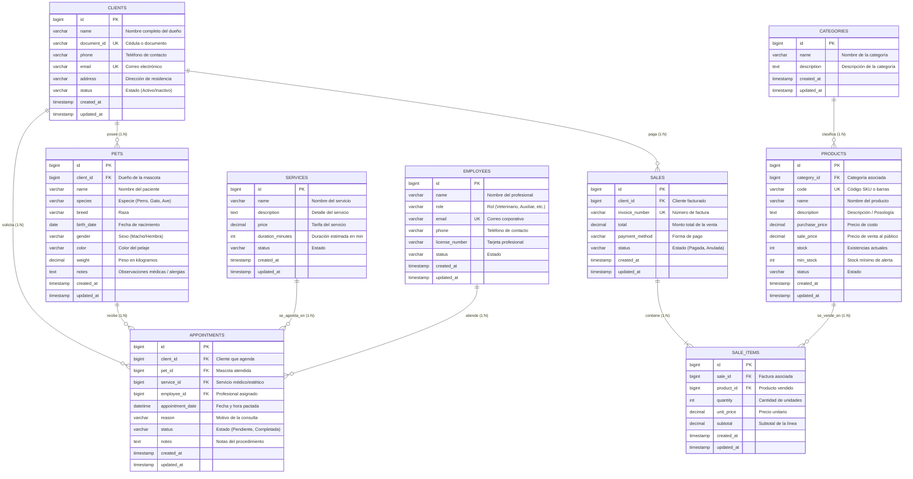

# Documento de Análisis y Diseño de Software de Gestión Empresarial (ERP)
## Caso de Estudio: Veterinaria Huellitas
**Asignatura:** Software de Gestión Empresarial  
**Institución:** COTECNOVA - 2026  
**Estudiantes:** Andrés Felipe & Miguel Ángel  
**Evaluación:** Primer Parcial - Corte 1  

---

# 1. Análisis del Negocio (30%)

## 1. Datos Generales
- **Nombre de la Empresa:** Veterinaria Huellitas
- **Giro del Negocio:** Prestación de servicios integrales de salud médica veterinaria (consultas generales y especializadas, vacunación, desparasitación, cirugías, odontología, hospitalización), servicios estéticos y de bienestar animal (baño medicado, peluquería canina y felina), y comercialización al por menor de productos farmacéuticos veterinarios, alimentos concentrados y dietas de prescripción, accesorios y juguetes para mascotas.
- **Tamaño:** Pequeña empresa (PYME), con proyección de crecimiento a mediano plazo mediante la apertura de nuevas sedes o ampliación de servicios diagnósticos.

## 2. Procesos Clave

- **Ventas:**  
  El flujo de ventas inicia en el mostrador o recepción cuando un cliente solicita un producto (medicamento formulado, suplemento, alimento seco/húmedo o accesorio). El recepcionista o cajero consulta en el sistema ERP la disponibilidad en inventario, valida el precio de venta unitario y, si se trata de un medicamento bajo fórmula, verifica la prescripción emitida por el veterinario. Se agregan los productos a la orden de venta (mostrando descripción, cantidad, impuestos y descuentos aplicables), se calcula el total general, se selecciona el medio de pago (efectivo, tarjeta de débito/crédito o transferencia electrónica) y se genera la factura o comprobante fiscal correspondiente. Automáticamente, el ERP deduce las existencias físicas del inventario y registra la transacción en el libro contable de ventas del día.

- **Servicios:**  
  Inicia con la solicitud de una atención por parte del dueño de la mascota (presencial, telefónica o por canales digitales). El recepcionista verifica en el ERP si el cliente y su mascota ya están registrados; en caso negativo, se realiza el alta rápida de ambos. Se selecciona el tipo de servicio requerido (consulta médica general, refuerzo de vacunación, cirugía programada, profilaxis o peluquería) y se agenda la cita verificando en tiempo real la disponibilidad de los consultorios y del profesional veterinario asignado. Llegado el día de la cita, el médico veterinario examina a la mascota y registra en el módulo de historial clínico los signos vitales, peso actual, anamnesis, diagnóstico, procedimientos ejecutados y medicamentos aplicados o formulados. Al finalizar la atención, el servicio prestado (y los insumos o fármacos utilizados) se transfiere automáticamente a la cuenta del cliente para su cobro y facturación en caja.

- **Compras:**  
  El proceso se activa cuando el módulo de inventario alerta sobre productos o fármacos que han alcanzado su nivel mínimo de seguridad (stock mínimo) o por requerimiento especial del área médica. El encargado de compras elabora y emite una orden de compra hacia distribuidores autorizados de medicamentos y laboratorios farmacéuticos certificados. Al arribar la mercancía a la clínica, el auxiliar de bodega realiza la recepción técnica confrontando la remisión física contra la orden de compra, verificando cantidad, estado del empaque, número de lote y fecha de vencimiento. Con la aprobación técnica, se asienta la factura del proveedor en el ERP, actualizando inmediatamente el kardex de inventario y programando la cuenta por pagar respectiva.

- **Inventario:**  
  El control de existencias se fundamenta en un kardex digital permanente clasificado por categorías de productos (Medicamentos, Alimentos, Accesorios, Juguetes, Higiene). Cada movimiento de entrada (por compras a proveedores) o de salida (por ventas directas en mostrador, consumo en intervenciones quirúrgicas o tratamientos clínicos) actualiza de forma síncrona el saldo disponible. El sistema cuenta con mecanismos de control de vencimiento (PEPS - Primeras en Entrar, Primeras en Salir), emitiendo alertas preventivas para productos con proximidad a caducar, así como notificaciones automáticas cuando un artículo está por debajo del umbral de stock mínimo para evitar desabastecimientos de insumos críticos de urgencias.

- **Clientes:**  
  La gestión de clientes se estructura bajo una relación jerárquica persona-mascota. Se registran los datos de identificación y contacto del dueño (cédula de ciudadanía o documento de identidad, nombres completos, número telefónico celular, correo electrónico y dirección domiciliaria). A este perfil se vinculan todas las mascotas que el dueño posea, guardando para cada una su nombre, especie (perro, gato, exótico), raza, fecha de nacimiento estimada o exacta, sexo, color de pelaje, microchip y observaciones clínicas relevantes. Este registro unificado permite enviar notificaciones personalizadas sobre recordatorios de vacunas, desparasitaciones periódicas y revisiones de control postoperatorio.

## 3. Problemas Detectados en la Situación Actual
1. **Pérdida de información y dispersión del historial clínico:**  
   Al gestionar la atención médica en cuadernos físicos y libretas de apuntes, los historiales de salud se deterioran, se extravían o quedan ilegibles. En situaciones de urgencia veterinaria, resulta imposible ubicar rápidamente el historial de alergias, cirugías previas o tratamientos farmacológicos anteriores de la mascota, comprometiendo la calidad de la atención y la vida del paciente.
2. **Descontrol de inventarios y pérdidas económicas por vencimiento de insumos:**  
   El uso de hojas de cálculo de Excel desactualizadas y no sincronizadas genera discrepancias constantes entre el inventario físico y el digital. Esto ocasiona tanto roturas de stock en fármacos vitales (anestésicos, antibióticos, sueros) como compras duplicadas y pérdidas por medicamentos de alto costo que caducan en estantería sin haber sido identificados a tiempo.
3. **Carencia de métricas gerenciales y lentitud en la toma de decisiones:**  
   Al no contar con una plataforma integrada, el propietario de la veterinaria carece de visibilidad sobre los ingresos reales del negocio, la rentabilidad por línea de servicio (clínica vs. peluquería vs. tienda de alimentos) y la productividad de los profesionales. La consolidación contable mensual toma días y es propensa a errores aritméticos, imposibilitando tomar decisiones estratégicas fundamentadas en datos.

## 4. Justificación del ERP
La implementación de un ERP en la **Veterinaria Huellitas** es imprescindible porque transformará un modelo operativo manual, reactivo y desarticulado en un ecosistema empresarial digital, eficiente y centralizado.  
El ERP resolverá de raíz los problemas identificados mediante:
- **Centralización e Integridad del Dato:** Una base de datos relacional única donde el expediente de la mascota, el stock de farmacia, la agenda médica y la caja registradora interactúan sin fisuras.
- **Trazabilidad Clínica Total:** Disponibilidad 24/7 del expediente médico digital de cada paciente, facilitando una atención médica certera y profesional.
- **Optimización de Recursos y Eficiencia Financiera:** Eliminación de mermas por vencimientos, reposición oportuna de insumos y facturación exacta sin omisiones de cobros de servicios prestados.
- **Ventaja Competitiva y Experiencia de Cliente:** Capacidad de enviar recordatorios automáticos a los dueños sobre planes de vacunación y citas, incrementando la retención de clientes y mejorando el posicionamiento de mercado de la clínica.

---

# 2. Diseño del Modelo de Datos (30%)

## Entidades Requeridas y Relaciones
El sistema está diseñado en torno a 9 entidades relacionales principales que soportan integralmente la operación clínica y comercial del ERP:
1. **clients (dueños de mascotas):** Registro del cliente / persona natural responsable de las mascotas y titular de las facturas.
2. **pets (mascotas / pacientes):** Pacientes receptores de las atenciones y servicios médicos. Relación `1:N` con `clients`.
3. **categories (categorías):** Clasificación funcional de los productos en inventario (Medicamentos, Alimentos, Accesorios, etc.).
4. **products (productos e insumos):** Catálogo de artículos disponibles para la venta o uso clínico con control de precios y stock. Relación `N:1` con `categories`.
5. **services (servicios médicos y estéticos):** Catálogo de atenciones ofrecidas (consultas, cirugías, vacunación, peluquería) con tarifas fijadas.
6. **employees (personal de la veterinaria):** Registro de médicos veterinarios, auxiliares, recepcionistas y estilistas.
7. **appointments (citas y agendamiento):** Programación y control de citas entre un cliente, su mascota, el servicio a recibir y el empleado responsable.
8. **sales (ventas / facturación):** Encabezado de la factura de venta comercial o de cobro de servicios, asociada al cliente.
9. **sale_items (detalle de venta):** Registro línea a línea de los productos y servicios facturados, cantidades, precios unitarios y subtotales.

---

## Diagrama Entidad-Relación (ER)

---

## Diccionario de Datos Extendido

### Tabla 1: `clients` (Dueños de Mascotas)
| Campo | Tipo | Nulo | Llave | Descripción |
|---|---|---|---|---|
| `id` | BIGINT UNSIGNED | NO | PK | Identificador único autoincremental del cliente |
| `name` | VARCHAR(150) | NO | | Nombres y apellidos completos del dueño |
| `document_id` | VARCHAR(50) | SÍ | UNIQUE | Cédula de ciudadanía o documento de identidad |
| `phone` | VARCHAR(20) | NO | | Número telefónico / celular principal de contacto |
| `email` | VARCHAR(150) | SÍ | UNIQUE | Dirección de correo electrónico para notificaciones |
| `address` | VARCHAR(255) | SÍ | | Dirección domiciliaria del propietario |
| `status` | VARCHAR(20) | NO | | Estado del cliente (`Activo` / `Inactivo`) |
| `created_at` | TIMESTAMP | SÍ | | Fecha y hora de registro en el sistema |
| `updated_at` | TIMESTAMP | SÍ | | Fecha y hora de la última modificación |

### Tabla 2: `pets` (Mascotas / Pacientes)
| Campo | Tipo | Nulo | Llave | Descripción |
|---|---|---|---|---|
| `id` | BIGINT UNSIGNED | NO | PK | Identificador único autoincremental de la mascota |
| `client_id` | BIGINT UNSIGNED | NO | FK | Llave foránea hacia `clients(id)` (ON DELETE CASCADE) |
| `name` | VARCHAR(100) | NO | | Nombre de la mascota o paciente |
| `species` | VARCHAR(50) | NO | | Especie animal (`Perro`, `Gato`, `Ave`, `Exótico`) |
| `breed` | VARCHAR(100) | SÍ | | Raza específica de la mascota |
| `birth_date` | DATE | SÍ | | Fecha de nacimiento exacta o calculada |
| `gender` | VARCHAR(20) | SÍ | | Sexo del animal (`Macho` / `Hembra`) |
| `color` | VARCHAR(50) | SÍ | | Color característico del pelaje o señas particulares |
| `weight` | DECIMAL(5,2) | SÍ | | Peso del animal en kilogramos (ej: 14.50 kg) |
| `notes` | TEXT | SÍ | | Observaciones clínicas permanentes, alergias o condiciones |
| `created_at` | TIMESTAMP | SÍ | | Fecha y hora de creación de la ficha de la mascota |
| `updated_at` | TIMESTAMP | SÍ | | Fecha y hora de la última actualización médica |

### Tabla 3: `products` (Productos y Medicamentos)
| Campo | Tipo | Nulo | Llave | Descripción |
|---|---|---|---|---|
| `id` | BIGINT UNSIGNED | NO | PK | Identificador único autoincremental del producto |
| `category_id` | BIGINT UNSIGNED | SÍ | FK | Llave foránea hacia `categories(id)` (ON DELETE SET NULL) |
| `code` | VARCHAR(50) | NO | UNIQUE | Código de barras o SKU institucional (ej: `MED-0001`) |
| `name` | VARCHAR(150) | NO | | Nombre comercial del producto o fármaco |
| `description` | TEXT | SÍ | | Descripción terapéutica, concentración o especificación |
| `purchase_price`| DECIMAL(12,2)| NO | | Costo unitario de adquisición al proveedor |
| `sale_price` | DECIMAL(12,2) | NO | | Precio de venta unitario al público |
| `stock` | INT | NO | | Cantidad física disponible en bodega/farmacia |
| `min_stock` | INT | NO | | Nivel mínimo de existencias para disparar alerta (default 5) |
| `status` | VARCHAR(20) | NO | | Estado del producto (`Activo` / `Descontinuado`) |
| `created_at` | TIMESTAMP | SÍ | | Fecha y hora de alta en inventario |
| `updated_at` | TIMESTAMP | SÍ | | Fecha y hora de la última modificación o movimiento |

### Tabla 4: `categories` (Categorías de Productos)
| Campo | Tipo | Nulo | Llave | Descripción |
|---|---|---|---|---|
| `id` | BIGINT UNSIGNED | NO | PK | Identificador único de la categoría |
| `name` | VARCHAR(100) | NO | | Nombre descriptivo de la categoría |
| `description` | TEXT | SÍ | | Alcance de los artículos agrupados |
| `created_at` | TIMESTAMP | SÍ | | Fecha y hora de registro |
| `updated_at` | TIMESTAMP | SÍ | | Fecha y hora de actualización |

### Tabla 5: `services` (Servicios Veterinarios y Estéticos)
| Campo | Tipo | Nulo | Llave | Descripción |
|---|---|---|---|---|
| `id` | BIGINT UNSIGNED | NO | PK | Identificador único del servicio |
| `name` | VARCHAR(150) | NO | | Denominación del servicio (ej: Consulta General) |
| `description` | TEXT | SÍ | | Detalle de los procedimientos incluidos |
| `price` | DECIMAL(12,2) | NO | | Tarifa oficial de cobro del servicio |
| `duration_minutes` | INT | NO | | Duración estimada del servicio en minutos |
| `status` | VARCHAR(20) | NO | | Disponibilidad del servicio (`Activo` / `Inactivo`) |
| `created_at` | TIMESTAMP | SÍ | | Fecha de creación |
| `updated_at` | TIMESTAMP | SÍ | | Fecha de actualización |

### Tabla 6: `appointments` (Citas y Agendamiento)
| Campo | Tipo | Nulo | Llave | Descripción |
|---|---|---|---|---|
| `id` | BIGINT UNSIGNED | NO | PK | Identificador único de la cita |
| `client_id` | BIGINT UNSIGNED | NO | FK | Llave foránea hacia `clients(id)` |
| `pet_id` | BIGINT UNSIGNED | NO | FK | Llave foránea hacia `pets(id)` |
| `service_id` | BIGINT UNSIGNED | SÍ | FK | Llave foránea hacia `services(id)` |
| `employee_id` | BIGINT UNSIGNED | SÍ | FK | Llave foránea hacia `employees(id)` |
| `appointment_date`| DATETIME | NO | | Fecha y hora programada de atención |
| `reason` | VARCHAR(255) | NO | | Motivo principal de la consulta |
| `status` | VARCHAR(30) | NO | | Estado (`Pendiente`, `En Atención`, `Completada`, `Cancelada`) |
| `notes` | TEXT | SÍ | | Anotaciones clínicas u observaciones adicionales |
| `created_at` | TIMESTAMP | SÍ | | Fecha de agendamiento |
| `updated_at` | TIMESTAMP | SÍ | | Fecha de última modificación |

---

# 3. Propuesta de Solución ERP (20%)

## 1. ¿Qué módulos tendría el ERP para la Veterinaria Huellitas?
Para dar respuesta integral a los requerimientos de gestión de la empresa, el ERP se estructurará en 6 módulos interconectados:
1. **Módulo de Gestión de Clientes y Pacientes (Historias Clínicas):**  
   Permite el alta, modificación y consulta de dueños y de sus mascotas asociadas. Incluye la historia clínica digital con registro cronológico de consultas, peso, signos vitales, vacunas aplicadas, desparasitaciones y alergias.
2. **Módulo de Agenda y Citas Médicas / Servicios:**  
   Calendario interactivo para programar consultas, cirugías, baños y vacunaciones. Asigna consultorios y profesionales responsables, previene cruces de horarios y permite notificaciones por correo o SMS.
3. **Módulo de Inventario, Farmacia y Compras:**  
   Control en tiempo real del stock de medicamentos, vacunas, alimentos y accesorios. Administra entradas por compras a proveedores, salidas por venta o consumo interno, control de lotes y fechas de vencimiento, y alertas de stock mínimo.
4. **Módulo de Punto de Venta (POS) y Facturación:**  
   Facturación rápida en caja para venta de mostrador y liquidación de servicios clínicos prestados. Emite facturas electrónicas/tickets, soporta múltiples formas de pago y descarga el inventario en el acto.
5. **Módulo de Personal y Profesionales Veterinarios:**  
   Administración del equipo humano (veterinarios, cirujanos, auxiliares, recepcionistas, peluqueros), horarios de turno, especialidades, tarjetas profesionales y comisiones por servicios prestados.
6. **Módulo de Reportes Gerenciales y Analítica (Dashboard & KPIs):**  
   Panel de control visual para el dueño con gráficas y métricas financieras, volumen de consultas, productos más vendidos, tasa de retención de clientes y estados de pérdidas y ganancias.

## 2. ¿Cómo se relacionan los módulos entre sí? (Flujo Completo del Negocio)
**Escenario Operativo:** *"Cuando un cliente llega con su mascota a consulta..."*

1. **Recepción y Verificación (Módulo de Clientes & Agenda):**  
   El cliente Carlos Mendoza se presenta en la clínica con su perro "Max". La recepcionista busca en el sistema por el número de cédula o nombre del perro. El sistema abre la ficha del cliente y visualiza si tiene cita agendada en el **Módulo de Agenda** o si es una consulta espontánea. Se confirma la asistencia y el estado de la cita cambia a *"En Espera"*.
2. **Atención Médica (Módulo de Pacientes & Historia Clínica):**  
   El médico veterinario Fernando Arango llama a Max a su consultorio. Abre el expediente clínico en el ERP, revisa los antecedentes y registra los nuevos signos vitales (peso: 31.5 kg, temperatura: 38.5 °C). Diagnostica una dermatitis por picadura de pulga, administra una dosis inyectable en consulta y prescribe una tableta de *Bravecto Antipulgas*.
3. **Consumo de Insumos y Actualización de Stock (Módulo de Inventario & Farmacia):**  
   Al guardar la consulta, el veterinario marca el medicamento inyectable suministrado en el consultorio. El **Módulo de Inventario** descuenta automáticamente esa unidad del stock de farmacia, manteniendo el inventario físico y contable perfectamente alineado.
4. **Liquidación y Cobro (Módulo de Ventas / Facturación):**  
   El cliente pasa a caja para retirar a su mascota y abonar los cargos. El cajero abre la orden de cobro vinculada a Carlos Mendoza: el sistema ya tiene cargados la *"Consulta Médica General"* ($45.000) y adiciona la tableta de *Bravecto* ($135.000). El total asciende a $180.000. El cliente paga con tarjeta débito, se emite la factura y se entrega el producto.
5. **Impacto Gerencial y Analítica (Módulo de Reportes & KPIs):**  
   La transacción incrementa las ventas del día, recalcula el ticket promedio, suma a la productividad del Dr. Arango y actualiza la tasa de rotación del medicamento en el panel gerencial. Adicionalmente, el sistema programa automáticamente un recordatorio para dentro de 12 semanas para el siguiente refuerzo de antipulgas.

## 3. Indicadores Clave de Desempeño (KPIs) para la Toma de Decisiones

| Indicador (KPI) | Fórmula / Definición | Meta Sugerida | Utilidad para el Dueño |
|---|---|---|---|
| **1. Valor Promedio de Ticket (VPT)** | $\frac{\text{Ingresos Totales en Ventas y Servicios}}{\text{Número Total de Clientes Atendidos}}$ | $> \$80.000$ COP | Permite identificar si los clientes están combinando servicios médicos con compra de medicamentos/alimentos, guiando estrategias de venta cruzada (cross-selling). |
| **2. Tasa de Rotación de Inventario Farmacéutico** | $\frac{\text{Costo de Mercancías Vendidas}}{\text{Inventario Promedio en Farmacia}}$ | $\ge 4$ veces/año | Mide la agilidad con la que se venden y reponen los medicamentos, evitando tener capital estancado o incurrir en pérdidas por caducidad de fármacos. |
| **3. Tasa de Ocupación de Consultas / Quirófano** | $\frac{\text{Horas Efectivas de Atención}}{\text{Horas Totales Disponibles en Agenda}} \times 100$ | $75\% - 85\%$ | Revela si la capacidad médica instalada está siendo aprovechada al máximo o si se requiere contratar más veterinarios o implementar promociones en horarios de baja demanda. |

## 4. Beneficios Obtenidos al Implementar el ERP

1. **Eliminación del 100% de pérdidas por descontrol de inventario y medicamentos vencidos:**  
   Gracias a las alertas automáticas de caducidad y stock mínimo con método PEPS, la veterinaria deja de desechar medicamentos vencidos y evita roturas de stock en fármacos vitales para urgencias.
2. **Optimización del tiempo de atención y fidelización de clientes:**  
   Los médicos veterinarios acceden al historial clínico digital en menos de 3 segundos, lo que agiliza los diagnósticos y genera confianza. Además, el envío automatizado de recordatorios para citas y vacunas aumenta la recurrencia de visitas en un 30%.
3. **Control financiero transparente y toma de decisiones en tiempo real:**  
   El dueño dispone de reportes automáticos diarios y mensuales sobre márgenes de utilidad, ingresos por servicio y rentabilidad por sede o empleado, eliminando el cuadre manual en papel y permitiendo planificar inversiones futuras con certidumbre.

---

# 4. Implementación Básica (20%)

## Resumen de la Implementación
- **Framework:** Laravel 11/12 con arquitectura MVC y ORM Eloquent.
- **Base de Datos:** MySQL / MariaDB (puerto 3306), base de datos `laravel`.
- **Modelos Creados:**
  - `Client.php`: Modelo con `$fillable` y relación `pets()` (`hasMany(Pet::class)`).
  - `Pet.php`: Modelo con `$fillable` y relación `client()` (`belongsTo(Client::class)`).
  - `Product.php`: Modelo con `$fillable` (`category_id`, `code`, `name`, `purchase_price`, `sale_price`, `stock`, `min_stock`).
  - `Service.php`, `Category.php`, `Employee.php`, `Appointment.php`.
- **Migraciones Creadas y Ejecutadas:**
  - `create_clients_table.php`
  - `create_pets_table.php`
  - `create_products_table.php`
  - `create_services_table.php`, `create_employees_table.php`, `create_appointments_table.php`.
- **Seeder Implementado:**
  - `ClientSeeder.php`: Pobla 6 clientes reales de la Veterinaria Huellitas con sus respectivas mascotas asociadas y notas clínicas.
  - `ProductSeeder.php`, `CategorySeeder.php`, `ServiceSeeder.php`.

## Verificación de Entregables Visuales
Las capturas de pantalla de evidencia se encuentran archivadas en la carpeta `docs/parcial/capturas/`:
1. `01_tablas_mysql.png`: Consulta `SHOW TABLES;` y `DESCRIBE clients;` en la base de datos MySQL.
2. `02_codigo_migraciones.png`: Evidencia del código fuente de las migraciones de `clients`, `pets` y `products`.
3. `03_codigo_modelos.png`: Evidencia del código fuente de los modelos `Client`, `Pet` y `Product` con sus relaciones.
4. `04_seeder_ejecutado.png`: Ejecución exitosa de `php artisan db:seed` y consulta de los registros insertados en MySQL/Tinker.